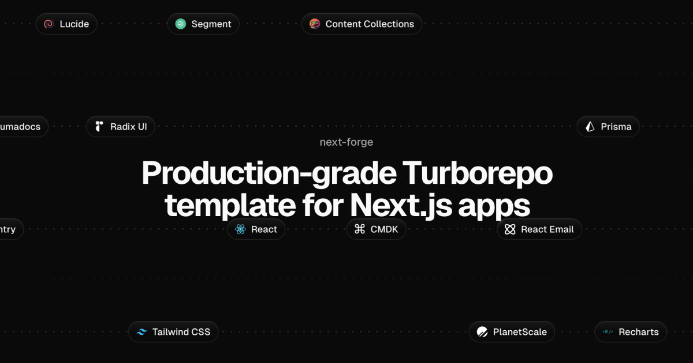

# next-forge

**A production-grade boilerplate for modern Next.js apps.**



[`next-forge`](https://github.com/haydenbleasel/next-forge) is a [Next.js](https://nextjs.org/) project boilerplate for modern web application. It is designed to be a comprehensive starting point for new apps, providing a solid, opinionated foundation with a minimal amount of configuration.

## Philosophy

`next-forge` is a culmination of my experience building web apps over the last decade and focuses on a few key principles:

1. The project should be **fast**. This doesn't just mean fast to build, run and deploy. It also means it should be fast to validate ideas, iterate and scale. This is important for finding product-market fit and growing a business.
2. The project should be **cheap**, at least to start. It should avoid a flat cost, or have a generous free tier. I try to make all my projects self-sustaining, so the goal is to avoid any recurring costs upfront and find services that scale with me.
3. The project should be **opinionated**. This means that the tooling should be designed to work together, and the project should be designed to work with the tooling. This is important for reducing friction and increasing productivity.
4. The project should be **modern**. This means that the tooling should be actively maintained, and the project should be designed to take advantage of the latest features. This is important for reducing technical debt and increasing longevity.

## Structure

`next-forge` is a monorepo, which means it contains multiple packages in a single repository. This is a common pattern for modern web applications, as it allows you to share code between different parts of the application, and manage them all together.

The monorepo is managed by [Turborepo](https://turbo.build/repo), which is a tool for managing monorepos. It provides a simple way to manage multiple packages in a single repository, and is designed to work with modern web applications.

The monorepo contains the following apps:

- `app` — The main, which contains the Next.js app.
- `api` — The API, which contains serverless functions designed to run separately from the main app e.g. webhooks and cron jobs.
- `web` — The website, which contains the static website for the app e.g. marketing pages and legal docs.
- `docs` — The documentation, which contains the documentation for the app e.g. guides and tutorials.

It also contains the following packages:

- `@repo/design-system`: The design system, which contains shared components, utility files and styles.
- `@repo/email`: The email templates, which contains the email templates for the app.
- `@repo/database`: The database, which contains the database schema and migrations for the app.
- `@repo/typescript-config`: The TypeScript configuration, which contains the shared TypeScript configuration for the app.

## Usage

First, scaffold the app with:

```sh
pnpm create next-app --example https://github.com/haydenbleasel/next-forge
```

Then, run the setup script and pass in the name of your app / company:

```sh
./setup.sh Acme
```

Login to Stripe with:

```sh
stripe login
```

Login to Planetscale with

```sh
pscale auth login
```

Finally, run the development server with:

```sh
pnpm dev
```

Open the following URLs to see the app:

- [http://localhost:3000/](http://localhost:3000/) — The main app.
- [http://localhost:3001/](http://localhost:3001/) — The website.

## Deploying

`next-forge` is designed to be deployed on Vercel with the [BetterStack](https://vercel.com/integrations/betterstack) and [Sentry](https://vercel.com/integrations/sentry) integrations. This will take care of the relevant API keys and tokens.

## Notes

- `next-forge` makes use of a custom proxy setup for Segment's client-side library to avoid ad-blocker issues. This is not required, but recommended. You'll need to contact Segment support to enable this in your UI. Read more about this [here](https://segment.com/docs/connections/sources/catalog/libraries/website/javascript/custom-proxy/#custom-cdn--api-proxy).
